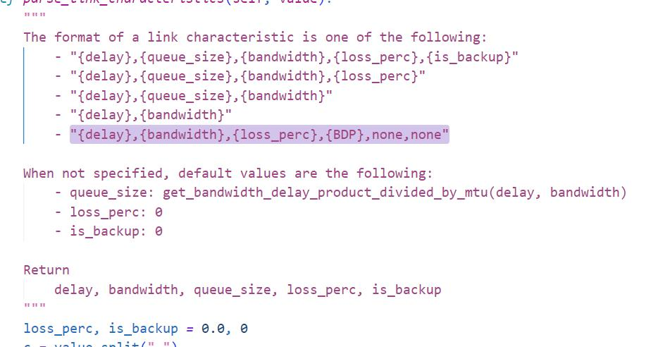
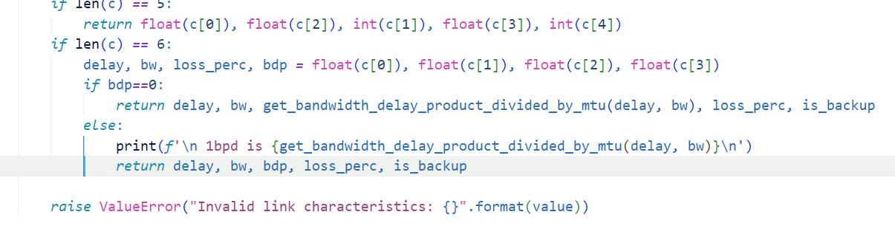
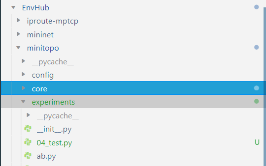
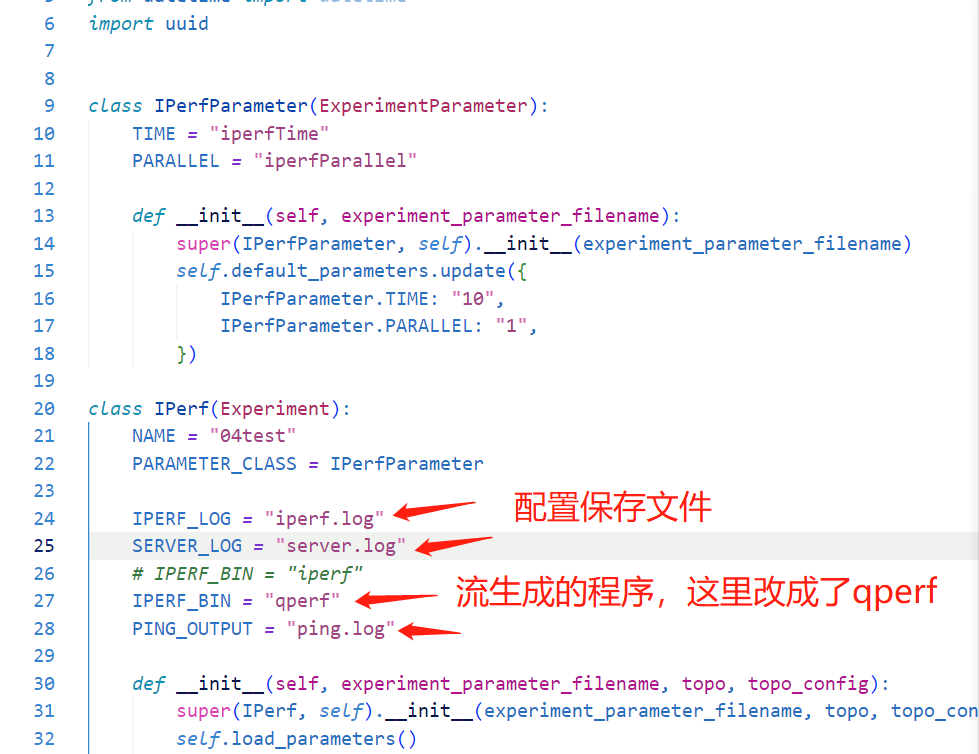
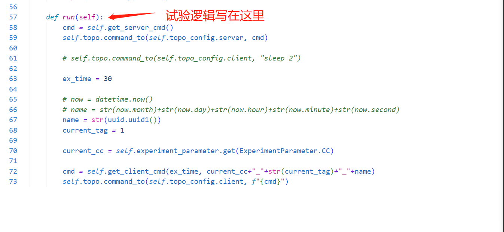
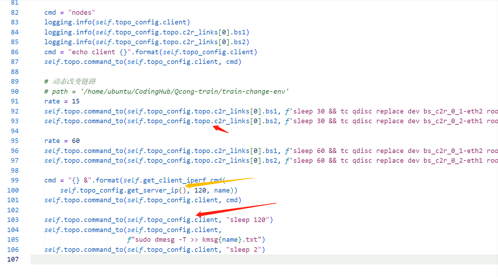

这个仓库涉及一些你使用minitopo进行试验需要了解的知识 和 一些你需要的文件

1. 增加自定义BDP能力

替换 topo.py 文件到 你的试验环境中的minitopo中的对应文件。这里增加了一个配置字段，用于自定义环境的BDP(实验带宽积)

2. 如何自己设计试验

所有试验相关文件均在这个experiment目录下

下面以iperf_scenario.py为例

注意，NAME参数所指即为你之后运行时，配置文件需要指定的xpType;你可以使用iperf完成试验，不必改为qperf

试验的逻辑在run函数里面

如果你想在minitopo里面实现动态链路参数配置，可以参考下面的例子(当然使用measureFramework其实是更好的选择)

实验相关的拓扑配置文件和实验配置文件，参考sigcomm20_mptp_tutorial项目里面tutorial_files里面的几个实验。建议采用单路径拓扑。
